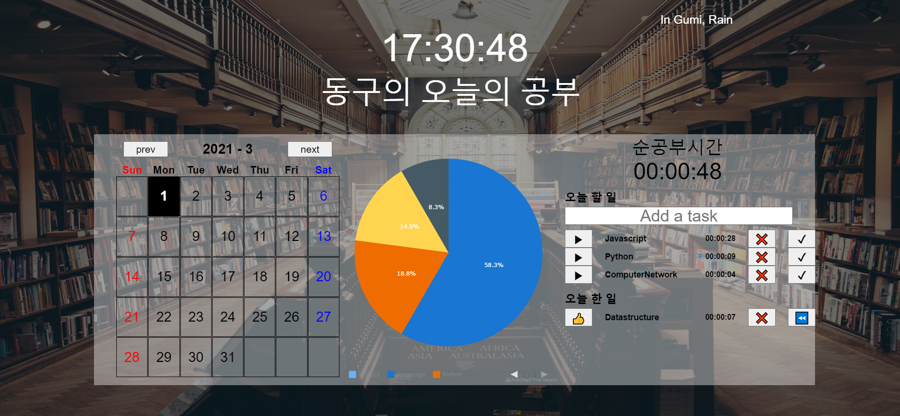

# Record today's study

- [DEMO_PAGE](https://ehdrn463.github.io/todoList-made-of-vanilaJS-anychartLIB/ "Go demo-page")

## Features

- Record today's study time using a calendar
- Check some days's study time
- Sava names and tasks
- Show time distribution
- Show temperature and weather using an weather API
- Using vanila javascript except for pie-chart which is applied with any-chart javascript library

## Patch Notes

- 1st
  - Record Only today's study time
  - Save names and tasks
  - Show temperature and weather using an weather API
    
- 2nd
  - Record today's study time using a calendar
  - Check some days's study time
    
- 3rd (Update scheduled)
  - Refactoring
  - Responsive

## under construction

- hide pie chart when data is none
- responsive (media query)
